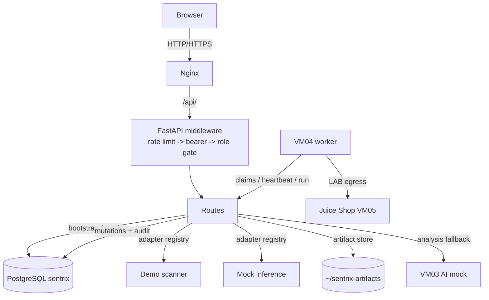
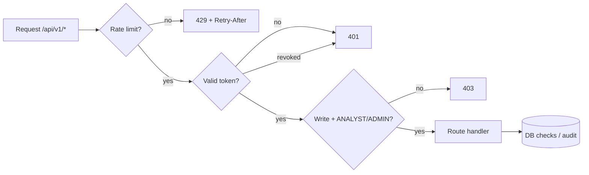
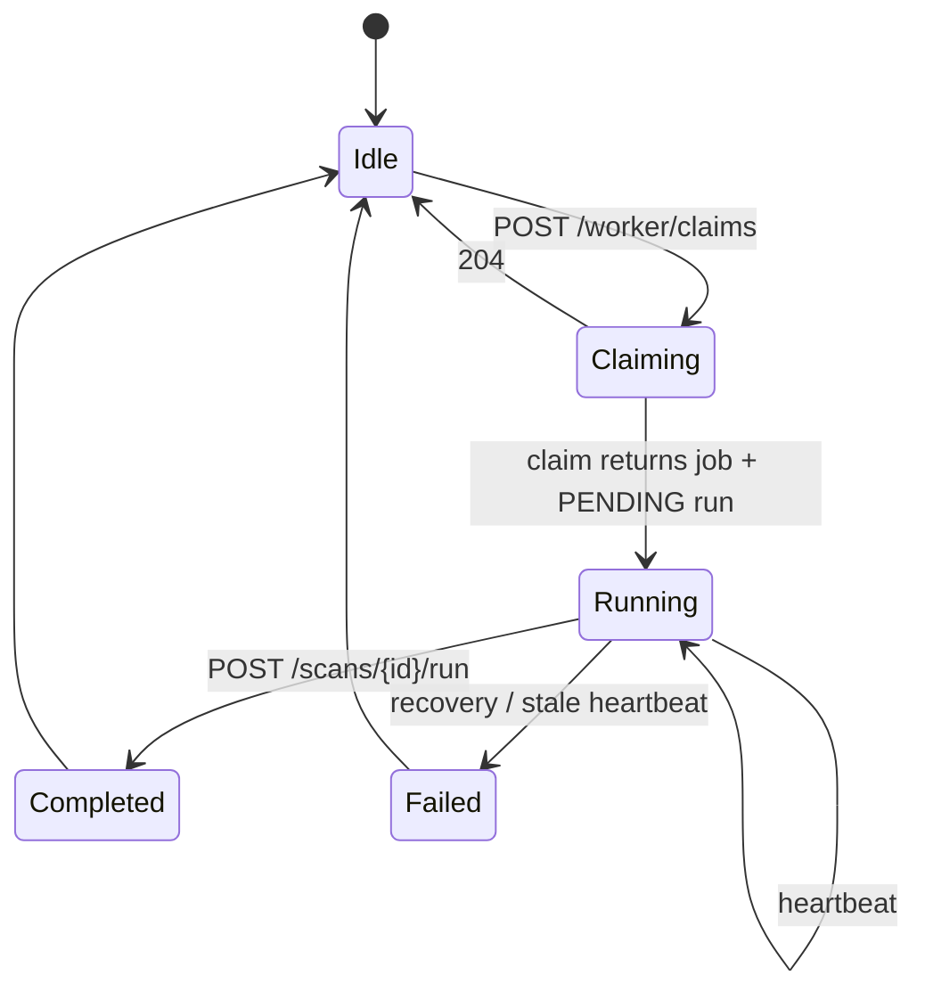

# Backend flowchart

```mermaid
flowchart TB
    Browser[Browser] -->|HTTP/HTTPS| N[Nginx]
    N -->|/api/| MW[FastAPI middleware<br/>rate limit -> bearer -> role gate]
    MW --> R[Routes]
    R -->|bootstrap / reads| DB[(PostgreSQL sentrix)]
    R -->|mutations + audit| DB
    R -->|adapter registry| SC[Demo scanner]
    R -->|adapter registry| MI[Mock inference]
    R -->|artifact store| FS[(~/sentrix-artifacts)]
    R -->|analysis fallback| AI[VM03 AI mock]
    W[VM04 worker] -->|claims / heartbeat / run| R
    W -->|LAB egress| LAB[Juice Shop VM05]
```

## Request / guard chain

```mermaid
flowchart LR
    REQ[Request /api/v1/*] --> RL{Rate limit?}
    RL -->|no| E429[429 + Retry-After]
    RL -->|yes| AUTH{Valid token?}
    AUTH -->|no| E401[401]
    AUTH -->|revoked| E401
    AUTH -->|yes| ROLE{Write + ANALYST/ADMIN?}
    ROLE -->|no| E403[403]
    ROLE -->|yes| HANDLER[Route handler]
    HANDLER --> DB[(DB checks / audit)]
```

## Worker state flow

```mermaid
stateDiagram-v2
    [*] --> Idle
    Idle --> Claiming: POST /worker/claims
    Claiming --> Idle: 204
    Claiming --> Running: claim returns job + PENDING run
    Running --> Running: heartbeat
    Running --> Completed: POST /scans/{id}/run
    Completed --> Idle
    Running --> Failed: recovery / stale heartbeat
    Failed --> Idle
```
