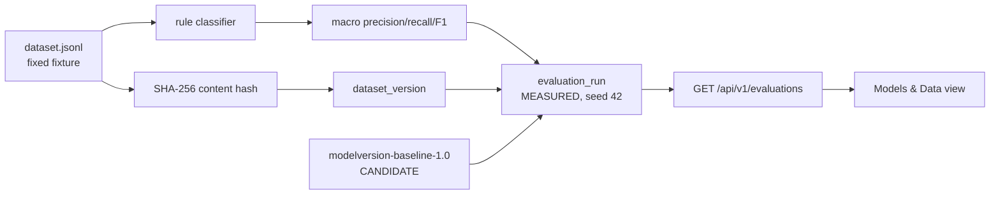

# M7 evaluation flowchart

```mermaid
flowchart LR
    D[dataset.jsonl<br/>fixed fixture] --> H[SHA-256 content hash]
    D --> P[rule classifier]
    P --> M[macro precision/recall/F1]
    H --> V[dataset_version]
    M --> R[evaluation_run<br/>MEASURED, seed 42]
    V --> R
    MV[modelversion-baseline-1.0<br/>CANDIDATE] --> R
    R --> API[GET /api/v1/evaluations]
    API --> UI[Models & Data view]
```

Simulated rows are kept separate: only `data_origin=MEASURED` runs represent
experiment results.
