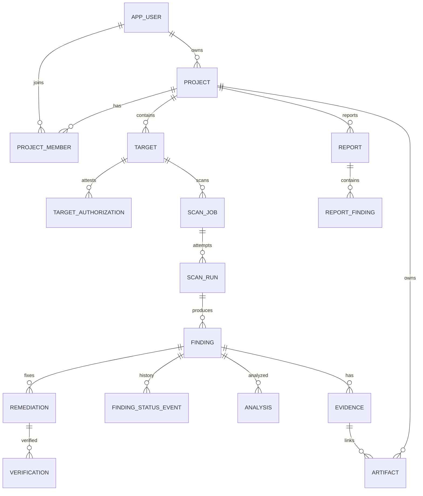
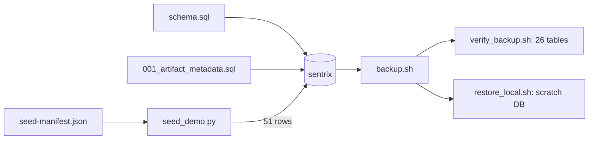
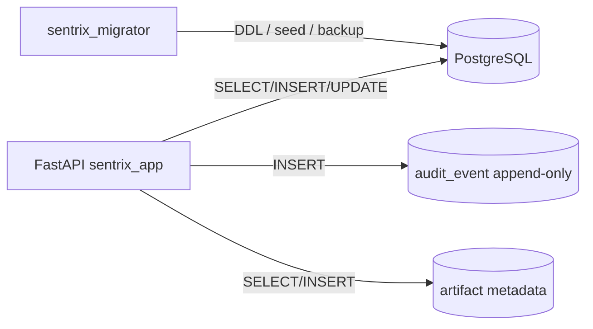

# Database flowchart

```mermaid
erDiagram
    APP_USER ||--o{ PROJECT : owns
    PROJECT ||--o{ PROJECT_MEMBER : has
    APP_USER ||--o{ PROJECT_MEMBER : joins
    PROJECT ||--o{ TARGET : contains
    TARGET ||--o{ TARGET_AUTHORIZATION : attests
    TARGET ||--o{ SCAN_JOB : scans
    SCAN_JOB ||--o{ SCAN_RUN : attempts
    SCAN_RUN ||--o{ FINDING : produces
    FINDING ||--o{ EVIDENCE : has
    FINDING ||--o{ FINDING_STATUS_EVENT : history
    FINDING ||--o{ ANALYSIS : analyzed
    FINDING ||--o{ REMEDIATION : fixes
    REMEDIATION ||--o{ VERIFICATION : verified
    PROJECT ||--o{ REPORT : reports
    REPORT ||--o{ REPORT_FINDING : contains
    PROJECT ||--o{ ARTIFACT : owns
    EVIDENCE ||--o{ ARTIFACT : links
```

## Migration / seed flow

```mermaid
flowchart LR
    S[schema.sql] --> D[(sentrix)]
    M[001_artifact_metadata.sql] --> D
    SEED[seed-manifest.json] --> SD[seed_demo.py]
    SD -->|51 rows| D
    D --> B[backup.sh]
    B --> V[verify_backup.sh: 26 tables]
    B --> R[restore_local.sh: scratch DB]
```

## Runtime access

```mermaid
flowchart LR
    API[FastAPI sentrix_app] -->|SELECT/INSERT/UPDATE| D[(PostgreSQL)]
    API -->|INSERT| AUDIT[(audit_event append-only)]
    API -->|SELECT/INSERT| ART[(artifact metadata)]
    MIG[sentrix_migrator] -->|DDL / seed / backup| D
```
