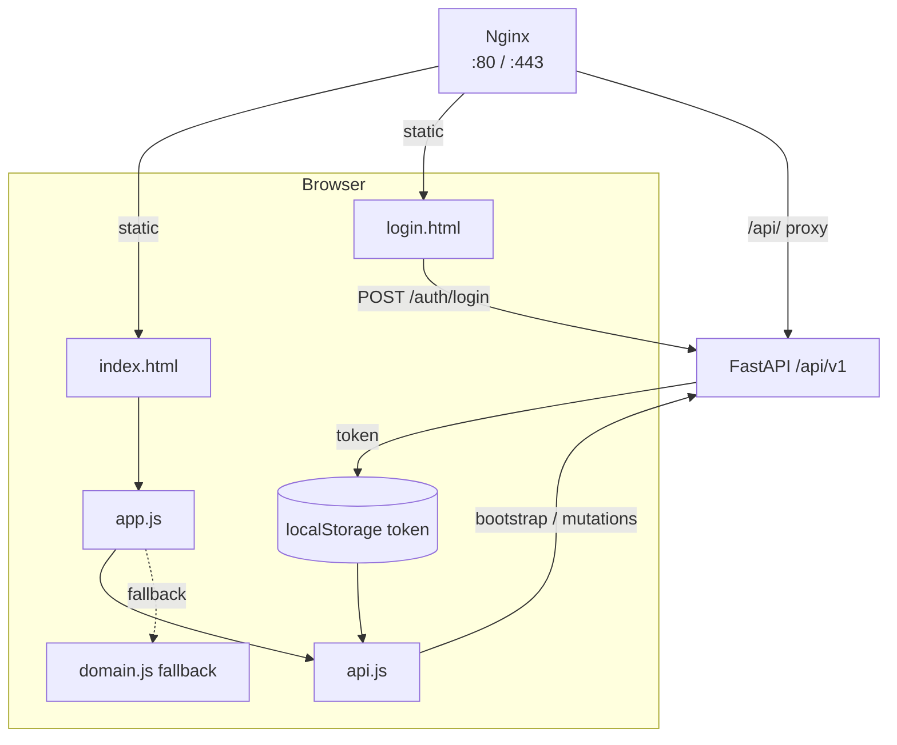
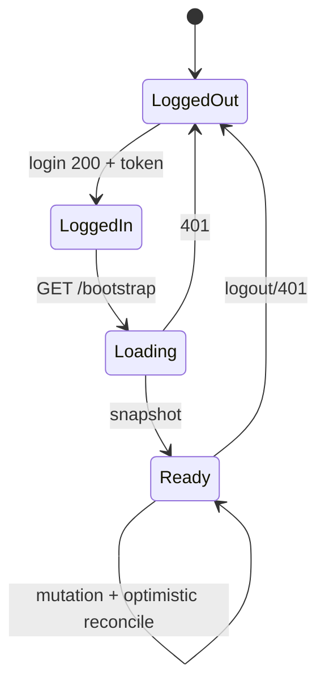

# Frontend flowchart

```mermaid
flowchart TB
    subgraph Browser
        Login[login.html]
        Shell[index.html]
        App[app.js]
        Adapter[api.js]
        Repo[domain.js fallback]
        Token[(localStorage token)]
    end

    N[Nginx<br/>:80 / :443]
    API[FastAPI /api/v1]

    Login -->|POST /auth/login| API
    API -->|token| Token
    Token --> Adapter
    Shell --> App
    App --> Adapter
    App -. fallback .-> Repo
    Adapter -->|bootstrap / mutations| API
    N -->|static| Shell
    N -->|static| Login
    N -->|/api/ proxy| API
```

## State flow

```mermaid
stateDiagram-v2
    [*] --> LoggedOut
    LoggedOut --> LoggedIn: login 200 + token
    LoggedIn --> Loading: GET /bootstrap
    Loading --> Ready: snapshot
    Loading --> LoggedOut: 401
    Ready --> Ready: mutation + optimistic reconcile
    Ready --> LoggedOut: logout/401
```
