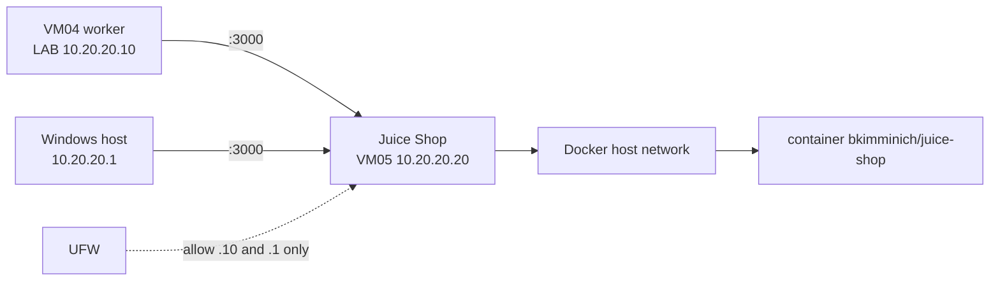

# SENTRIX lab flowchart

```mermaid
flowchart LR
    W[VM04 worker<br/>LAB 10.20.20.10] -->|:3000| J[Juice Shop<br/>VM05 10.20.20.20]
    H[Windows host<br/>10.20.20.1] -->|:3000| J
    J --> D[Docker host network]
    D --> C[container bkimminich/juice-shop]
    U[UFW] -.->|allow .10 and .1 only| J
```

VM05 has no NAT or default route. The lab is for local demo only.
